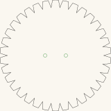
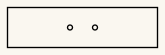

# Buzz disc

Two cut-ready designs for a buzz disc — a flat piece threaded on a cord loop that winds
and unwinds as you pull, spinning the disc back and forth. A toothed rim turns the whirr
into a buzz. Output is millimetre-true — `1 user unit = 1 mm` with a physical
`width`/`height` — so it prints and cuts at real size.

<!-- readme-only -->
**[Read the writeup](https://gernreich.github.io/buzz-disc/)**

<table>
<tr>
<td align="center"><a href="BuzzDisc1.svg"></a></td>
<td align="center"><a href="BuzzDisc2.svg"></a></td>
</tr>
<tr>
<td align="center"><sub>Toothed disc · 160 × 161mm</sub></td>
<td align="center"><sub>Plain bar · 150 × 40mm</sub></td>
</tr>
</table>

*Click one to download its cut file. Each is at its own scale, so read the sizes rather
than the pictures. These are display renderings — the cut files draw a hairline on no
background, which a browser shows almost invisibly.*

Built for **[LaserMadeMusic](https://www.youtube.com/@LaserMadeMusic)**, where the
cutting and the spinning are shown.

**[The rest of the build files](https://gernreich.github.io/)** — every instrument,
generator and tool, indexed.

**[Download everything as a ZIP](https://github.com/Gernreich/buzz-disc/archive/refs/heads/main.zip)** — both designs.

## What is in each file

Measured out of the files, not copied from whatever drew them:

| Design | Outline | Cord holes | Spacing |
|---|---|---|---|
| `BuzzDisc1.svg` | 160.5 × 160.7mm, sawtooth rim | two, 5mm | 30mm apart |
| `BuzzDisc2.svg` | 150.0 × 40.0mm rectangle | two, 5mm | 25mm apart |

In both, the holes straddle the centre and sit on the centreline — that symmetry is what
lets the disc wind and unwind evenly instead of wobbling. Each file is cropped to the part
itself, so the sheet **is** the outline.

**Colour is the cut order**, and everything is a cut — there is no engrave layer. Run
**green first** for the two cord holes, while the part is still whole, then **black** for
the outline, which frees it. Give both an explicit operation; a per-colour job silently
skips any colour you leave unmapped.

The full sequence is shared by every LaserMadeMusic repository — blue engraves, then
green → orange → cyan → black, with black always the cut that frees the part. These two
designs need only the first and last of those.

**The toothed disc is the buzzing one** — the teeth chopping the air are the sound. It is
also heavier, so it stores more energy and runs longer between pulls. **The plain bar**
has no teeth and far less area: quieter, faster to spin up, and the easier first cut.

## Before you cut

**Cut these in 3mm Baltic birch plywood** — what they are built in. The cord holes are
where it fails, under real tension, so the void-free core of Baltic birch is worth the
difference over a cheaper sheet.

**Two or more laminations may sound better.** Cut the shape twice or three times and glue
the copies face to face: more mass at the same radius stores more energy per wind and runs
longer between pulls, and the teeth meet the air with a deeper edge. Line the cord holes up
when you glue.

**The cord is not in these files.** A continuous loop through both holes is the usual
arrangement; length and thickness are yours to settle by trying.

## Handle it with care

**This one spins close to you** — held between two hands at chest height, with your face
above it — and the lamination advice above deliberately makes it heavier.

- **Mass.** The toothed disc is at most about **41g** at one 3mm thickness, **83g**
  laminated twice, **124g** three times. (The teeth remove material, so those are upper
  bounds.)
- **Speed.** A wound cord releases fast, and the rim travels far quicker than the centre.
  The rim is where all the teeth are.
- **Shape.** The toothed rim is the whole point of the design and a ring of points at
  speed. It does not have to be sharp to catch skin.

Keep it **clear of your face**, and check both holes and the loop before each session —
especially on a laminated disc, where the glue line runs straight through them. The plain
bar has no teeth and far less area: it is the gentler one to learn the motion with.

## Checking the files

Both designs are gated by **`flat-part-check.py`** in
[lasermade-tools](https://github.com/Gernreich/lasermade-tools), which measures the
geometry rather than reading the drawing — millimetre-true units, bed fit, closed cuts,
the palette and its cut order, and the material left around every hole:

```sh
python3 ../lasermade-tools/flat-part-check.py --dir .
```

Both pass: **18 checks, 0 failed**, with 5mm cord holes and 25.0mm (disc) and 17.5mm (bar)
of material between a hole and the nearest edge — no margin worth worrying about here, and
the glue line through the holes on a laminated disc matters more than the geometry does.
`.github/workflows/check.yml` runs the same command on every push.

`BuzzDisc1.svg` is the file that taught the gate two of its own bugs: its outline closes
without a `z`, ends meeting to 0.00009mm, and it starts at 3 o'clock — exactly the height
of both cord holes, which is the degenerate case for a point-in-polygon test. The tool's
README tells that story.

## Files

| | |
|---|---|
| `BuzzDisc1.svg` · `BuzzDisc2.svg` | the two cut-ready designs |
| `previews/` | display renderings — **not** cut files |
| `index.md` · `index.html` | the published page; the markdown is the source |
| `.github/workflows/check.yml` | runs the pre-cut gate on every push |

Released under [CC0 1.0](LICENSE).
